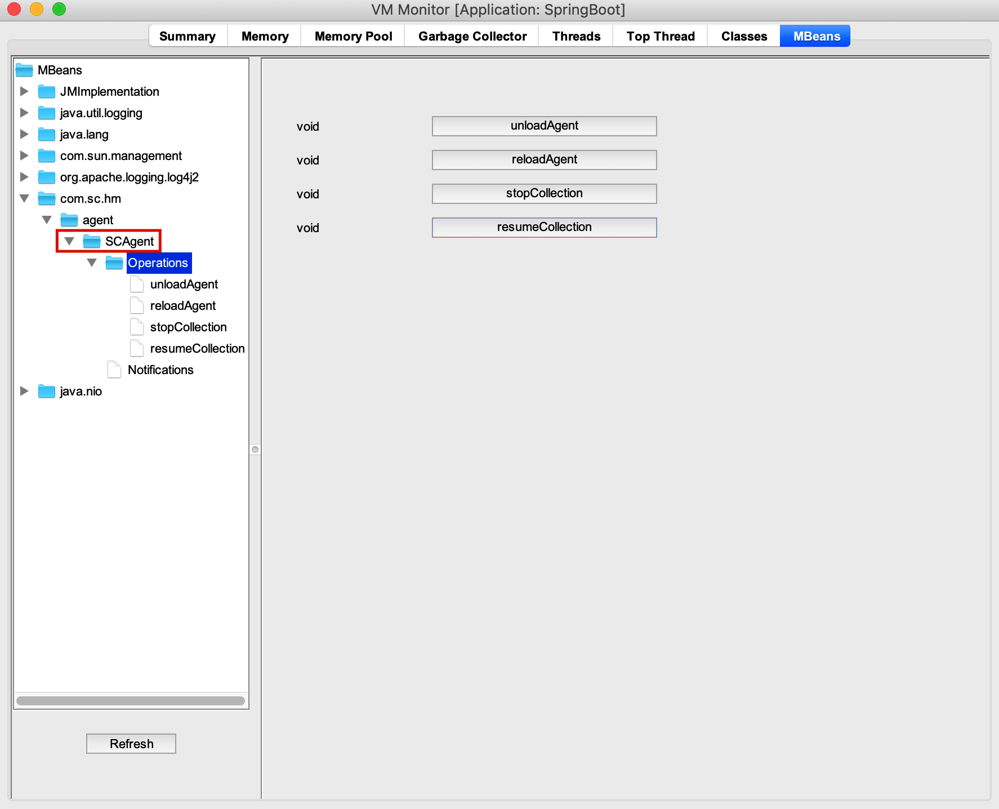

## My Note
Do you like playing with class file bytes? How about manipulating the raw class bytes in the JVM, keeping the old version somewhere in JVM, inject code during runtime, changing the behavior of any newly constructed objects, later bring back the old class definition ?

## Summary
Often there is a need to **profile** your java application, in order to find out various pressure point. Profiling is the process of monitoring various JVM level parameters such as Thread Local Allocation Buffer, Classloader Statistics, Method Execution, String pool Statistics, Thread Execution, Object Creation, Garbage Collection, I/Os, etc. It provides with a finer view of the target application execution and its resource utilisation. It further eliminates the need to spend long hours going through the code, and pinpoints the problems associated with your application.

Java Mission Control (jmc) is a fantastic tool for profiling your java application, however, it provides a comprehensive view of your application and include all kind of system classes if a bottleneck is identified there. Using JMC, even a non-developer or sysadmin can easily get to see and find the bottleneck of your application. Also being a commercial feature, one has to get the license for the same.

**java-agent** is particularly useful for the developer and especially for certain use cases. Let's say you are building a REST API or a Spring Controller or any other backend/serverside application. Once the API is finished you may want to perform some performance testing before you actually roll it out to production. There are varioous performance testing tool available in the market, e.g., Apache Benchmark (ab), JMeter etc. But these tools will only give you the average response time of the API (end point). But as a developer, you may be interested to know, which (java) method or piece of code took most of the time, and only then you can make your code more robust and scalable. This is where **java-agent** comes handy.

It also registers it's own **MBeans** with the **Platform MBean Server**, through which one can monitor the profiling, stop it and resume it, and also revert back the changes to bring the JVM in it's original state. All these without restarting your application. See **Appendix C**

## How to Use
The **java-agent** uses bytecode injection feature to instrument your code. Let us understand this with a sample application.

Imagine the following classes part of your simple REST application.

AccountController.java class exposes a REST end point: POST /accounts .

```
@RestController
@RequestMapping(path = "/accounts"
        , produces = MediaType.APPLICATION_JSON_VALUE
        , consumes = MediaType.APPLICATION_JSON_VALUE)
public class AccountController {
    
    @RequestMapping(method = RequestMethod.POST)
    public ResponseEntity createAccount(@RequestBody Account account) {
        // Create the account first.
        AccountService service = new AccountService();
        service.create(account);
        
        // Send notification too downstream system (via kafka/jms, etc)
        sendNotif(account);
        return ResponseEntity.created(URI.create("/accounts/"  + account.getId())).build();
    }
    
    private void sendNotif(Account account) {
        // Create kafka/jms producer.
        // Send the message.
    }
}
```

AccountService.java class makes a call to database or other storage to persist the new account details.

```
public class AccountService {

    static {
        Class.forName("your.favorite.rdbms.driver.name");
    }
    
    public void create(Account account) {
        // Make database call to persist the new account details.
        // Let's say, we are using some RDBMS system as a backend.
        Connection conn = DriverManager.getConnection("<url>", "<user>", "<password>");
        PreparedStatement pstmt = conn.prepareStatement("INSERT INTO ACCOUNTS (ID, TYPE, BALANCE) VALUES (?, ?, ?)");
        pstmt.setString(1, account.getId());
        pstmt.setString(2, account.getType());
        pstmt.setDouble(3, account.getBalance());
        
        int count = pstmt.executeUpdate();
        conn.commit();
        
        pstmt.close();
        conn.close();
    }
}
```

As we know the request flow (call stack), therefore it makes sense to profile the following two methods:
1. AccountController.createAccount(Account)
1. AccountService.create(Account)


### Steps to load java agent

#### Criteria
Ensure you are trying to load the java agent from the same box where your application is running.

#### Check out/Download java agent
Create a parent directory **java-agent**. Check out the **deploy** and **lib** directory.

#### Check what all **java** applications are available for profiling.
Run the below command:
```
java -jar deploy/java-agent-1.0-SNAPSHOT.jar --help
```

It will show you various option, plus the java processes running in the current box. See **Appendix A** for more details about the option.

Note the **process id** of your (REST) java application that you wish to monitor.

#### Create Configuration file
Create a configuration file (**/path/to/java-agent/classmap.dat**) to explicitly specify the class and/or method(s) that you want to profile.

Sample entries:
```
# Mapping for controller
<package.name>.AccountController-{createAccount}
# Mapping for service
<package.name>.AccountService-{create}
```
You can monitor a specific piece of code inside a method by specifying the start and end line numbers. But ensure the piece of code is valid, otherwise the instrumentation will fail.
e.g.,
```
# Mapping for controller
<package.name>.AccountController-{createAccount}
# Mapping for service
<package.name>.AccountService-{create}
<package.name>.DepartmentService-{create(172:190)}
```

#### Starting Agent
Start the agent by running the following command:
```
java -jar target/java-agent-1.0-SNAPSHOT.jar -a /path/to/java-agent/deploy/java-agent-1.0-SNAPSHOT.jar -p <process_id> -m /path/to/java-agent/classmap.dat -o /path/to/java-agent/temp -v N -s Y -j /path/to/java-agent/lib/javassist-3.12.1.GA.jar
```

You will see the following messages:
```
Uploading agent [/path/to/java-agent/deploy/java-agent-1.0-SNAPSHOT.jar] to remote process [<process_id>]
Detached from remote process [<process_id>]
```

At this point, both of your methods are instrumented.

You can start any performance monitoring tool (e.g., Apache Benchmark) to hit the POST /accounts end point, and the agent will start dumping the profile statistics in the specified directory, as identified by **-o** option, in HTML format.

E.g, of Apache Benchmark command:
```
ab -k -c 2 -n 5 -T application/json -p ./payload.json  http://localhost:8080/accounts
```
Where payload.json is:
```
{
  "id": "ALE191016EMAIL33304100017L5000",
  "type": "Savings Account",
  "balance": 350000
}
```

## Appendix A
1. **-a** :    Path to java agent library
1. **-p** :    Remote JVM Process Id
1. **-m** :    Path to classmap.dat
1. **-d** :    Specify if dumping of metrics is enabled [default: Y]
1. **-i** :    Specify the interval (in seconds) the metrics would be dumped [default: 900]
1. **-o** :    Specify the dump directory, where the metrics (HTML) file will be generated.
               The file name syntax: <process_id>@<machine_name>_trace_<yyyy_MM_dd_HH_mm_ss>.html
1. **-v** :    On|Off the verbose [default: Y]
1. **-l** :    Specify the log directory where the agent log will be generated (only if verbose is set to Y).
               The log file name would be **agent-profile.log**.
1. **-c** :    Specify the directory where the instrumented class(s) will be dumped [default: dump directory]
1. **-s** :    Specify if javaassist library is needed to be loaded by remote vm [default: N]
1. **-j** :    Path to javaassist library (required if -s option is specified)

## Appendix B
HTML table column name and what doo they represent:

1. **Iteration**         - Iteration count
1. **Thread Name**       - Thread that is executing the current method/block of code.
1. **Execution Start**   - When the method execution was started.
1. **Execution End**     - When the method execution ended.
1. **Duration (millis)** - Time took to complete the execution.
1. **CPU Time**          - Average CPU time.
1. **User Time**         - Average User time.
1. **Call Stack**        - Method stack trace to identify the origin of the call.

## Appendix C
MBean for the java-agent.



Operations:
* unloadAgent - It will revert back the instrumented classes to their original state.
                The agent maintains the old version of the class file byte in it's memory, so that the newly instrumented
                class can be reverted back to their original state as and when required.
* reloadAgent - It will initiate the instrumentation again.
* stopCollection - Instruct the agent to stop the collection. Note that the instrumented classes to stay in the memory.
* resumeCollection - Instruct the agent to resume the collection again.

